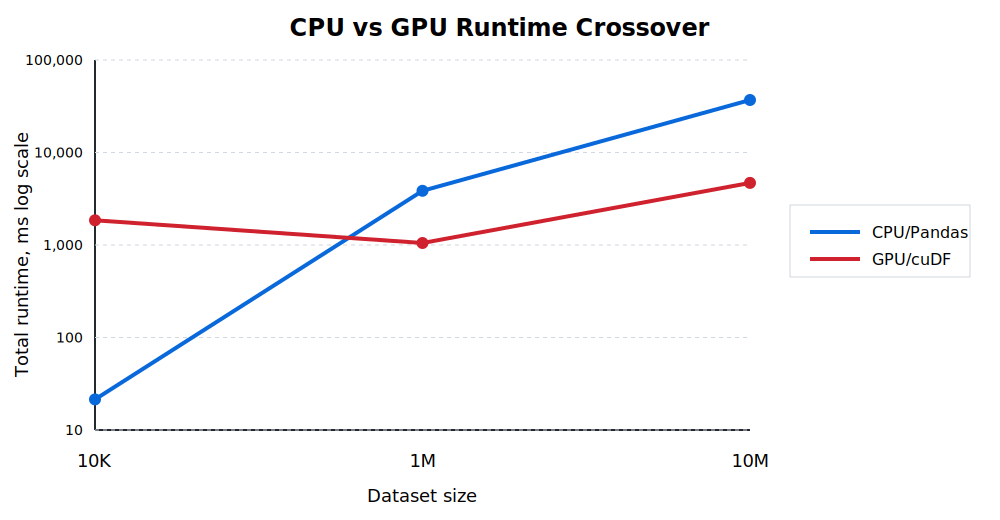

# GPU-Accelerated Honeypot Telemetry Analytics

_A DGX Spark benchmark comparing CPU/Pandas and NVIDIA RAPIDS/cuDF for high-volume Cowrie-style honeypot telemetry._

## Key Result

This project benchmarks CPU and GPU analytics pipelines for Cowrie-style SSH honeypot telemetry. On a 10 million record synthetic dataset, NVIDIA RAPIDS/cuDF on DGX Spark reached about **2.02 million records/sec**, compared with about **269K records/sec** for the CPU/Pandas baseline.

At 10M records, the GPU pipeline delivered about **7.5x higher end-to-end throughput**.

| Dataset | CPU/Pandas Total | GPU/cuDF Total | Result |
|---:|---:|---:|---|
| 10K | 47.40 ms | 2,673.02 ms | CPU faster; GPU overhead dominates |
| 1M | 3,855.97 ms | 1,275.38 ms | GPU/cuDF ~3.0x faster |
| 10M | 37,099.22 ms | 4,949.73 ms | GPU/cuDF ~7.5x faster |



The benchmark shows a clear crossover point: CPU/Pandas is faster at small scale, but GPU/cuDF becomes significantly faster as telemetry volume grows.

## What This Demonstrates

This project demonstrates an end-to-end accelerated-computing evaluation:

- define a realistic telemetry workload
- build comparable CPU and GPU implementations
- benchmark scaling behavior across 10K, 1M, and 10M records
- separate ingestion time from analytics runtime
- identify where GPU acceleration improves throughput
- document limitations and future optimization paths

The goal is not simply to show that a GPU is faster. The goal is to measure when GPU acceleration becomes useful and which parts of the pipeline still constrain performance.

## Processing Pipeline

```text
Cowrie JSONL logs
      |
      v
Sanitized local sample
      |
      v
Synthetic benchmark generation
      |
      v
+-------------------------+      +----------------------------+
| CPU/Pandas baseline     |      | GPU/RAPIDS cuDF baseline   |
| JSONL -> Pandas -> agg  |      | JSONL -> cuDF -> agg       |
+-------------------------+      +----------------------------+
      |                                      |
      v                                      v
Benchmark summaries, throughput comparison, bottleneck analysis
```

## Why This Might Help

Cowrie logs are easy to collect, but repeated analysis becomes expensive as telemetry grows. A local DShield or Cowrie operator may want to summarize large JSONL log files without uploading raw data elsewhere.

This project treats Cowrie/DShield-style telemetry as a customer workload: a local operator has high-volume honeypot logs and wants faster summarization while keeping raw telemetry under local control.

The benchmark separates JSON parse/load time, field normalization, aggregation runtime, and end-to-end throughput. That distinction matters because a GPU can only accelerate the parts of the pipeline that are actually moved into GPU-friendly processing.

## Real Data and Synthetic Scaling

This project uses a sanitized local Cowrie sample to validate field structure, parsing behavior, and the analytics workflow. The large benchmark datasets are synthetic because the goal is repeatable performance testing at controlled scales, not threat attribution.

The synthetic data preserves benchmark-relevant structure such as timestamps, event IDs, usernames, passwords, source actors, credential pairs, and bursty activity patterns. It should not be used to draw conclusions about real attacker behavior or Internet-wide credential trends.

A future version could run the same local analyzer against larger real Cowrie or DShield datasets if available.

## Benchmark Results

Benchmark platform: NVIDIA DGX Spark  
Largest dataset: 10,000,000 synthetic Cowrie-style SSH login records  
Largest file size: 2,052.94 MB

| Dataset | Method | Parse/Load | Analysis | Total | Throughput |
|---:|---|---:|---:|---:|---:|
| 10K | CPU/Pandas | 42.11 ms | 5.29 ms | 47.40 ms | 210,968 records/sec |
| 10K | GPU/cuDF | 2,620.54 ms | 52.48 ms | 2,673.02 ms | 3,741 records/sec |
| 1M | CPU/Pandas | 3,660.39 ms | 195.58 ms | 3,855.97 ms | 259,338 records/sec |
| 1M | GPU/cuDF | 1,097.84 ms | 177.54 ms | 1,275.38 ms | 784,079 records/sec |
| 10M | CPU/Pandas | 35,018.04 ms | 2,081.18 ms | 37,099.22 ms | 269,547 records/sec |
| 10M | GPU/cuDF | 3,544.57 ms | 1,405.16 ms | 4,949.73 ms | 2,020,311 records/sec |

## Findings

At 10K records, CPU/Pandas is faster because GPU initialization, JSON parsing, and dataframe setup overhead dominate the workload.

At 1M records, GPU/cuDF provides a clear throughput advantage.

At 10M records, GPU/cuDF processes roughly 2.02 million records per second and improves end-to-end throughput by about 7.5x over the CPU/Pandas baseline.

The largest improvement occurs in parse/load and dataframe construction. Aggregation also improves, but by a smaller margin. This suggests that GPU acceleration becomes more useful as telemetry volume grows, while pipeline design still needs to account for ingestion and normalization bottlenecks.

## Custom CUDA Projection

A custom CUDA/C++ kernel is a possible future optimization path, but the current 10M benchmark suggests that aggregation alone is not the dominant bottleneck.

In the 10M GPU/cuDF run:

| Stage | Time |
|---|---:|
| Parse/load | 3,544.57 ms |
| Analysis | 1,405.16 ms |
| Total | 4,949.73 ms |

Even if a custom CUDA kernel eliminated the analysis stage entirely, total runtime would only fall from about 4.95 seconds to about 3.54 seconds. That is a theoretical maximum improvement of roughly 28%.

A larger end-to-end improvement would likely require changing the input path, such as using Parquet or compact binary columns instead of raw JSONL.

See `docs/custom_cuda_projection.md` for more detail.

## Reproducing the DGX Spark Benchmark

Create the CPU/Pandas environment:

```bash
python3 -m venv .venv
source .venv/bin/activate
python -m pip install --upgrade pip
python -m pip install -r requirements.txt
```

Create the RAPIDS/cuDF environment:

```bash
conda env create -f environment-rapids-cuda13.yml
conda activate rapids-cuda13
```

Generate the 10M synthetic dataset:

```bash
python scripts/generate_synthetic_cowrie.py \
  --input data/real/cowrie_sanitized.jsonl \
  --output data/synthetic/synthetic_cowrie_10m.jsonl \
  --records 10000000 \
  --seed 20260623 \
  --profile failed-heavy \
  --days 7 \
  --start 2026-06-22T11:50:00Z \
  --src-ip-mode private-diverse \
  --exclude-values claude,openclaw,nvidia,grok,cursor
```

Run the CPU baseline:

```bash
source .venv/bin/activate

python scripts/run_cpu_pandas.py \
  --input data/synthetic/synthetic_cowrie_10m.jsonl \
  --bucket-minutes 5 \
  --min-attempts 1000 \
  --output results/dgx_cpu_pandas_10m_summary.md \
  --benchmark-csv results/benchmark_results.csv
```

Run the GPU baseline:

```bash
conda activate rapids-cuda13

python scripts/run_gpu_cudf.py \
  --input data/synthetic/synthetic_cowrie_10m.jsonl \
  --bucket-minutes 5 \
  --min-attempts 1000 \
  --output results/dgx_gpu_cudf_10m_summary.md \
  --benchmark-csv results/benchmark_results.csv
```

## Repository Layout

```text
scripts/
  generate_synthetic_cowrie.py   Synthetic Cowrie-style data generator
  run_cpu_pandas.py              CPU/Pandas benchmark pipeline
  run_gpu_cudf.py                GPU/RAPIDS cuDF benchmark pipeline

docs/
  methodology.md
  data_fidelity_and_sanitization.md
  limitations.md
  custom_cuda_projection.md
  dgx_spark_benchmark_summary.md

data/
  real/                          Local sanitized input; not committed
  synthetic/                     Generated benchmark data; not committed

results/
  Benchmark summaries and CSV outputs
```

## Limitations

This project is not an official DShield component, does not use unpublished DShield infrastructure, and does not claim to reproduce DShield’s full production workload.

The benchmark intentionally focuses on SSH credential-attempt analytics. It does not cover:

- full session reconstruction
- command analysis
- malware capture
- HTTP honeypot telemetry
- firewall log processing
- public-IP threat attribution
- DShield production ingestion or reporting workflows

The synthetic data is useful for repeatable performance testing, but it should not be treated as real threat intelligence.

## Roadmap

- Add a normalized intermediate representation for GPU-friendly processing.
- Benchmark Parquet or compact binary input against raw JSONL.
- Implement a custom CUDA/C++ frequency-analysis kernel only if profiling supports it.
- Compare CPU/Pandas, RAPIDS/cuDF, and custom CUDA paths.
- Package a local analyzer that Cowrie/DShield users could run against their own logs.
